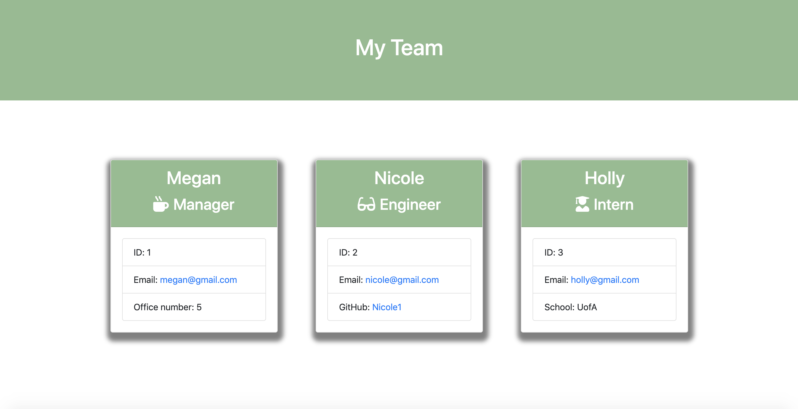

 <!-- your challenge is to build a Node CLI that takes in information about employees and generates an HTML webpage that displays summaries for each person. Since testing is a key piece in making code maintainable, you will also be ensuring that all unit tests pass. -->
# team-profile-generator

## Description

I built a Node CLI that takes in information about employees to create an engineering team and generates an HTML webpage displaying summaries for each employee. 

The engineering team consists of a:
* Manager

* Engineer(s)

* Intern(s)

Each team member displays their:
* Name

* Role

* ID

* Role-specific property:
    * Intern: School
    * Engineer: GitHub username
    * Manager: Office number

First the user is prompted for information about the team manager and then for information about the rest of the team. The user is able to enter in however many engineers and interns they would like. 
Once the user is done building the team an HTML file is created that displays the employees information. 

## Installation

   npm i

## Usage

To run the application the user must run 

    node app.js

Below is a picture of the HTML generated by the application. 

## Author

Megan Coppins

https://meganlcoppins.github.io/team-profile-generator/